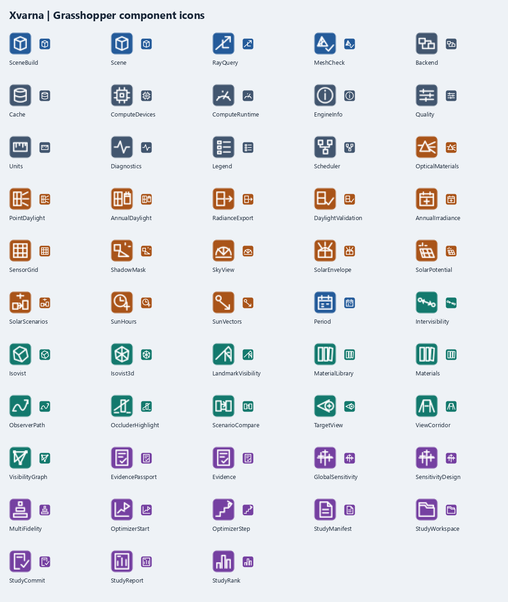

# XVARNA
<!-- publication-example -->


The actual Radiance runner returns about 9,998.81 lux under a 10,000-lux uniform sky and 4,999.41 lux of ground-reflected light against a 5,000-lux large-plane reference. The CSV is retained with the reproduction command.

[Run this example](publication/README.md) · [Release scope](SOURCE-RELEASE.md) · [Introduction draft](publication/linkedin.md)

## Implemented workflow

- Environmental and spatial studies with explicit geometry, weather and material provenance.
- Canonical CPU calculations, bounded GPU paths and reference comparisons.
- Sensitivity, study optimization and evidence records across native and Grasshopper adapters.

<!-- /publication-example -->


[Source release and practical use](SOURCE-RELEASE.md) · [Report a reproducible issue](CONTRIBUTING.md)

[September 2026 implementation review](docs/REVIEW-2026-09-18.md) · [Component icon catalogue](assets/icons/README.md)

<details>
<summary>Operation-specific Grasshopper icons (24 px and enlarged)</summary>



</details>


**Design by Evidence.**

XVARNA is an open-source, interactive environmental and spatial intelligence engine for computational design. The native core is written in Rust and exposed to Rhino/Grasshopper through thin, version-specific .NET connectors.

## Current status

The `1.0.0-rc.1` review candidate adds a first-class Rhino 9 + Grasshopper 2 connector without forking the scientific engine. Its 49 registered capabilities use the same semantic IDs and the same Rust/C/.NET contracts as the 49-component Grasshopper 1 connector. Rhino 8 + GH1 remains on .NET 8; Rhino 9 + GH1/GH2 uses .NET 10. The automated build/runtime/package/evidence pipeline is complete; external interactive review, AMD coverage, closed-beta KPIs, independent sign-off, soak, signing, DOI/site and public publication remain deliberately pending.

The connector is compiled against the exact official `Grasshopper2` prerelease matching the installed Rhino 9 WIP. The automated gate loads and constructs all 49 components (including vector icons) in that runtime, verifies unique serialization IDs and exact GH1/GH2 semantic-ID parity, then crosses geometry, surface-grid, sky-view, daylight, Target View, Study and Evidence contracts through the real native library. Basic flagship workflows use native mesh/point/vector/twig inputs; versionable JSON remains an optional Expert/import boundary. See [GH2 examples](examples/grasshopper2/README.md), the [twelve tutorials](docs/tutorials/README.md), and [compatibility contract](docs/architecture/compatibility-matrix.md).

The `0.18` evidence engine remains intact: hash-protected Evidence Passports, Saltelli/Jansen and Morris experiments, robust CVaR/chance-constraint summaries, conservative uncertainty-aware Pareto fronts, and cost-aware Fast→Reference selection. The selector is a transparent calibrated Monte-Carlo EHVI policy, not a claim of qNEHVI or MF-HVKG. NVIDIA and Intel portable-GPU execution is captured in reproducible local evidence; AMD and external-project evidence remain before a public release.

## Grasshopper 2 connector 0.19

`Xvarna.Grasshopper2.rhp` is an independent host adapter, not a recompiled GH1 assembly. All analysis remains in the shared Rust core and `Xvarna.Native`: ZAMYAD scene/rays, VAYU CPU/GPU sessions and telemetry, ZURVAN/HVARE solar, ASMAN sky, MEHR irradiance and surface intelligence, DAENA spatial/view attribution, daylight/Radiance, VAHMAN Study/optimization/reporting, and RASHNU evidence.

The Rhino 9 archive and Yak package contain both the GH1 `.gha` and GH2 `.rhp`. The current automated evidence is an isolated installed-runtime gate plus representative end-to-end numerical contracts; an interactive Rhino canvas acceptance pass and real `.gh2` example documents remain release-candidate tasks because the GH2 SDK itself is prerelease. No Rhino 8 + GH2 compatibility is claimed.

## RASHNU Evidence and VAHMAN Multi-Fidelity 0.18

`XV Evidence` qualifies every important result with immutable scene/result/input identity, method and fidelity, backend/device/tool version, deterministic seed, effective samples, runtime, assumptions, limitations, citations, and parity/reference diagnostics. `XV Sensitivity+` generates the exact external-evaluation rows for Saltelli/Jansen or Morris and refuses reordered, incomplete, or hash-mismatched outputs. `XV Fidelity` learns an inspectable Fast-to-Reference discrepancy correction and recommends the most valuable expensive simulations per unit cost.

The same workflow is available through `xvarna evidence ...`, six additive C ABI functions, and the typed .NET `EvidenceEngine`. Analytic fixtures validate known Sobol/Morris effects, CVaR, confidence-interval dominance, calibration, and deterministic selection. See the [.NET guide](docs/sdk/evidence.md) and [ADR 0018](docs/adr/0018-scientific-evidence-and-multifidelity.md).

## VAHMAN Study/Optimization/Report 0.16

`XV Manifest` defines named continuous/integer/categorical parameters, scalar or componentwise-vector objectives, residual constraints, baseline identity, and deterministic optimizer policy. `XV Workspace` journals every new external-evaluation batch together with the full optimizer/PRNG checkpoint, so closing Rhino or the CLI does not lose or advance pending candidates. `XV Commit` accepts only a complete aligned batch and is idempotent for an identical retry.

Constraint-aware Pareto ranking and crowding use every flattened vector component. Sensitivity now reports Spearman association with deterministic bootstrap intervals, two-sided permutation p-values, and Holm family-wise correction; it remains explicitly associative rather than causal. A declared baseline produces parameter/objective changes and exact delta maps for compatible indexed/spatial fields.

`XV Report` produces complete embedded JSON, a typed Apache Parquet table, an embedded-buffer glTF 2.0 objective-space asset, a self-contained narrative HTML report, and an independent interactive viewer that requires neither Rhino nor a CDN. See [the persistence/statistics/export validation contract](docs/validation/study-platform.md) and [the 0.16 release notes](docs/releases/0.16.0.md).

## HVARE Daylight and Radiance 0.15

**2026-09-19 validation update:** the actual Radiance 6.0.2 point runner passed analytical sky and ground-interreflection checks. [Commands, values and boundaries](docs/validation/radiance-executed.md).

`XV Daylight` returns direct, diffuse, total lux and Daylight Factor with a reusable matrix identity and visible cache hit. `XV Annual Daylight` processes EPW intervals into sensor-level and area-weighted sDA, direct-only ASE, four-bin UDI, occupied illuminance distributions, cancellation/progress, and deterministic provenance. `XV Optical` supplies one energy-conserving RGB material catalog shared with `XV Radiance`, which exports exact world geometry, sensors, Object-ID material mapping, and a machine-readable manifest.

The standalone runner discovers an explicit Radiance installation, executes cancellable `oconv/rtrace` point references or weather-independent `rfluxmtx` + `gendaymtx` + `dctimestep` annual matrices, and records tool version, exact commands, runtime, matrix reuse, and hashes. `XV Daylight Δ` reports bias, MAE, RMSE, MAPE, maximum error, R², and explicit tolerance acceptance.

The Fast Path deliberately omits multi-bounce interreflection and is not itself an LM-83 certification workflow. Radiance was not installed on the 0.15 release host, so external binary execution is not claimed as validated there. See [the complete scientific contract](docs/validation/daylight-radiance.md).

## DAENA Spatial and Solar Intelligence 0.14

`XV Isovist 3D` traces an equal-solid-angle sphere and returns radial volume, radial surface measure, transmission-weighted openness, convergence, every endpoint, ranked obstruction, exact category partitions, and exact remove-one re-tracing. `XV Landmark` combines camera FOV, analytic apparent solid angle, deterministic partial coverage, declared importance, and material-aware source attribution. `XV Compare` calculates candidate-minus-baseline spatial and object-attribution deltas for aligned studies, while `XV Highlight` maps the resulting stable Object IDs back to Rhino source meshes.

`XV Materials` provides one validated visible/direct-solar optical catalog. `XV Solar Scenarios` compares material alternatives over an identical scene/sensor/sun schedule with a complete transmission timeline, received/lost hours, ranked object/category loss, and baseline deltas. `XV Solar Envelope` solves material-aware ray constraints along per-candidate freeform axes and reports access-preserving and target-shading distances with controlling sensor/time provenance; omitted axes retain the original World-Z behavior.

The solar envelope is an early-massing screening proxy—not a zoning/compliance envelope or a multi-bounce radiosity model. Material coefficients apply per geometric interaction, and unassigned objects are opaque. See [the 0.14 scientific and validation contract](docs/validation/daena-spatial-solar-intelligence.md).

## ZAMYAD/VAYU Lifecycle 0.13

`XV Scene` now distinguishes rarely changed static instances from interactive dynamic instances. When mesh resources are unchanged, Grasshopper sends an atomic delta transaction instead of compiling the whole scene. Unchanged BLAS resources are shared between immutable snapshots; each layer independently reuses, refits, or rebuilds its TLAS under explicit quality and consecutive-refit limits. Existing readers and compute sessions retain the prior snapshot safely.

VAYU no longer expands every instance into world-space triangles. Its WGSL shader traverses a TLAS, transforms rays into instance space, and traverses shared BLAS data while retaining exact 64-bit source identity. Deterministic geometry chunks are streamed through one resident working set under separate geometry and total VRAM budgets. CPU f64 remains canonical, and device-loss behavior still follows explicit Auto fallback or required-GPU failure.

Portable plans are cached in bounded process memory and a versioned disk directory. Entries use BLAKE3 keys/checksums, schema validation, temporary writes plus atomic rename, LRU/oldest-entry eviction, and automatic corrupt-entry removal. `XV Cache`, `XV Backend`, and `XV Runtime` expose hit/miss, write, eviction, recovery, chunk, streaming, and transfer telemetry.

Compute-heavy Grasshopper components share a bounded scheduler instead of launching independent work. It provides queue backpressure, linked cancellation, phase/fraction progress, stale-generation suppression, and cumulative outcomes through `XV Scheduler`. See [the 0.13 lifecycle validation contract](docs/validation/zamyad-vayu-lifecycle.md).

## VAYU Production Throughput 0.12

The first non-empty GPU request allocates two dynamic scratch slots sized to the workload, up to a documented per-slot operational ceiling. Later requests at the same or smaller size perform queue writes into the retained buffers without recreating GPU buffers or bind groups. Large batches are split deterministically and submitted in pairs, preserving exact input order and the existing CPU/GPU scientific contract.

The session records total requests, rays, dispatches, reused batches, runtime fallbacks, scratch generations/capacity/bytes, upload/readback bytes, device losses, execution errors, and the last exact diagnostic. `Auto` retries failures on canonical CPU; required `GPU` fails visibly. `XV Runtime` exposes the counters inside Grasshopper, while `xv_compute_get_runtime_stats` and `GetRuntimeStatistics()` expose the same additive contract to C and .NET callers.

`backend-benchmark` now separates the cold allocation run from configurable warm-up and measured iterations, reporting min/p50/p95/mean and phase-level p50 timing. `eng/benchmark-vayu-throughput.ps1` produces schema-versioned evidence across multiple ray counts and rejects parity, reuse, arena-growth, or health violations. Small analytic scenes remain validation smoke cases, not evidence for a universal speedup claim. See [the production-throughput validation contract](docs/validation/vayu-production-throughput.md).

## VAYU Domain Acceleration 0.11

`XV Target View`, `XV Corridor`, and `XV View Path` now accept either an immutable `XV Scene` or a cached `XV Backend` session. Existing CPU definitions remain valid. Connecting a backend enables VAYU without changing metric definitions, output ordering, source-unit conversion, stable IDs, hashes, or downstream Study objects. Every result carries aggregate batch/ray/dispatch counts, adapter identity, upload/execute/readback timings, maximum measured conversion error, and creation/runtime fallback state.

The Rust domain engines depend on a backend-neutral closest-hit executor rather than a GPU-specific API. Canonical f64 ZAMYAD remains the reference implementation; VAYU implements the same contract and retains the canonical scene for hashing and scientific policy. Dynamic paths batch all target rays for each source path, while corridor definitions form bounded batches that retain first-conflict attribution.

All three CLI workflows expose `--backend`, adapter/resource/precision controls, and `--verify-cpu`. Verification re-runs the exact domain study on canonical CPU, compares numeric metrics plus state/identity attribution, prints the maximum absolute delta, and returns failure if the declared tolerance is exceeded. Real-device domain parity passed on NVIDIA RTX 5060 and Intel Raptor Lake/Vulkan with zero metric or identity mismatch on the release smoke cases. See [the domain-acceleration validation contract](docs/validation/vayu-domain-acceleration.md).

## VAYU — Portable Compute 0.10

VAYU is named for the ancient Iranian deity associated with wind, atmosphere, and space. `XV Devices` discovers portable adapters and drivers. `XV Backend` compiles and caches an execution session in `Auto`, required `GPU`, or `CPU` mode and can select a discovered device by a case-insensitive name filter. `XV Ray Query` accepts that session directly and reports the backend, dispatch count, transfer/execution/readback time, precision error, and fallback state of every batch.

The Rust engine converts the canonical f64 ZAMYAD snapshot into an origin-rebased f32 execution snapshot only when the caller's metric error budget can be met. It builds a deterministic global SAH BVH, uploads conservative nodes and effective world-space triangles, preserves complete 64-bit object/instance/mesh/category identity, and traverses them in a bounded WGSL compute shader. Triangle count, BVH depth, adapter binding limits, workgroup limits, and rays per dispatch all have explicit ceilings.

`Auto` never silently changes the scientific contract: creation-time and runtime fallback are surfaced in reports. `GPU` rejects failure instead of hiding it; `CPU` remains the canonical f64 path. The standalone `backend-benchmark` command compares state, attribution identity, and distance against CPU while separating upload, execution, and readback. Real-device smoke validation passed on NVIDIA RTX 5060 and Intel Raptor Lake graphics; broader performance claims remain gated on the published reference corpus. See [the VAYU validation contract](docs/validation/portable-gpu.md).

## DAENA Advanced View + VAHMAN Study 0.9

`XV Target View` measures exact target and rectangular-camera solid angles while using deterministic target-patch samples for partial occlusion. Raw Target View remains separate from declared category, distance, direction, and observer weights. Green View is selected by explicit target category bits. Every observer/target result retains convergence and the dominant first blocker.

`XV Corridor` tests protected circular target apertures with uniform-area sampling and source-attributed conflicts. `XV View Path` samples tangent-facing cameras along polylines, returns complete Target/Weighted/Green series, and computes distance-weighted means plus best/worst hotspots.

VAHMAN—XVARNA's Study engine—ranks arbitrary completed studies with feasibility-first Pareto dominance and NSGA-II crowding, calculates exact two-objective hypervolume and descriptive Spearman association, and runs deterministic mixed continuous/integer/categorical optimization. `XV Optimizer` and `XV Opt Step` expose an explicit ask/evaluate/tell loop, so any Grasshopper analysis, including DAENA, can become an objective without coupling the Rust optimizer to Rhino.

The advanced engine is also exposed through an additive C ABI, source-unit-aware .NET 8/10 APIs, and five CLI workflows. See [the advanced view and optimization contract](docs/validation/advanced-view-and-optimization.md).

## DAENA Spatial Visibility 0.8

DAENA is the new visibility and spatial-topology engine over the same immutable ZAMYAD scene used for environmental analysis. `XV Isovist` produces ordered Rhino polygons and radial trees plus area, perimeter, centroid offset, min/mean/max/standard-deviation/skew depth, compactness, full-versus-half-resolution convergence, open-space share, and dominant first blocker.

`XV Intervisibility` evaluates every observer-target pair and returns visible/blocked Rhino lines, state/distance/risk/blocker Data Trees, row and column exposure summaries, and a transparent directional privacy-screening equation. `XV Visibility Graph` traces unordered node pairs once and returns exact edges, blocked-pair attribution, degree, connected components, harmonic closeness, and Brandes betweenness. Resource caps fail explicitly before quadratic work can exhaust memory.

The Rust implementation is shared by C, .NET 8/10, Rhino 8/9, and three standalone CLI commands with complete CSV exports and schema-versioned JSON. DAENA treats meshes as opaque and its privacy result as a screening proxy—not a measured probability or compliance decision. See [the spatial visibility and privacy contract](docs/validation/spatial-visibility-and-privacy.md).

## MEHR Surface Intelligence 0.7

`XV Sensor Grid` accepts Rhino Mesh, Brep, Surface, and Extrusion geometry. The Rust core recursively bisects the longest triangle edge until the requested cell size is met, then returns one stable oriented sensor per cell together with exact area, source-face ID, subdivision depth, an analysis mesh, and a deterministic hash. It preserves valid source area and enforces a caller-visible hard cell ceiling instead of allowing an accidental resolution choice to exhaust memory.

Connect its points, normals, and IDs to `XV Irradiance`, then connect both immutable results to `XV Solar Potential`. Sensor IDs—not fragile list position—join results back to geometry. The component produces a bakeable Viridis false-colour mesh using the complete value range, honest area-weighted mean/P10/P50/P90, a threshold mask, edge-connected eligible region meshes, incident energy, capacity proxy, annual yield proxy, specific yield, and a full assumptions report.

The PV calculation is deliberately a screening proxy: eligible plane-of-array energy is multiplied by declared module efficiency, geometric coverage, and aggregate downstream loss. It is not presented as bankable yield and does not silently claim inverter-curve, temperature, degradation, module-layout, dispatch, or financial accuracy. See [the surface-intelligence validation contract](docs/validation/surface-intelligence-and-pv-proxy.md).

## MEHR — Annual Irradiance 0.6

MEHR turns an immutable ZAMYAD scene, oriented sensors, and a validated EnergyPlus Weather file into a complete sensor-major annual energy timeline. EPW end-of-interval local-standard timestamps are converted to UTC interval midpoints; hourly and subhourly radiation are retained as Wh/m² with explicit missing-value counts and a semantic weather hash.

For each surface, MEHR combines NREL SPA solar positions with the EnergyPlus-style Perez 1990 three-component tilted-surface model. Direct and circumsolar terms share an attributed closest-hit solar ray. The diffuse dome uses 144 ray-traced sky patches and the horizon term uses 24 azimuth sectors; ground reflection uses the documented isotropic view-factor model with EPW or fallback albedo. Outputs include direct/diffuse/ground/global kWh/m², peak W/m² and UTC time, dome/horizon visibility, first-hit timeline identity, dominant solar blocker and lost energy, dominant sky blocker, and a deterministic result hash.

`XV Irradiance` runs through Grasshopper's task scheduler on Rhino 8 and Rhino 9, produces a viewport heatmap and per-sensor timeline trees, and retains the full immutable result for downstream automation. The same engine is exposed as `xvarna annual-irradiance`, a stable C ABI, and synchronous/asynchronous .NET APIs with progress and cancellation. See [the scientific and validation contract](docs/validation/annual-irradiance.md).

## ASMAN — Sky Intelligence 0.5

ASMAN is XVARNA's sky-analysis engine, named for the Iranian concept and personification of the sky. `XV Sky View` samples each oriented hemisphere with a deterministic equal-solid-angle Fibonacci sequence and returns both unweighted visible hemisphere and Lambert cosine-weighted Sky View Factor. Every blocked direction retains object, instance, mesh, triangle, and distance identity; summaries expose the dominant projected obstruction and an interleaved-subset convergence diagnostic.

The Grasshopper component runs through the native cancellable job system instead of blocking the solution thread and previews sensor values with a Viridis heatmap. `XV Shadow Mask` extracts one complete direction set with a cyan/magenta viewport dome. The same workflow is available through .NET, the public C header, and `xvarna sky-view`, including full Shadow Mask CSV export. See [the scientific contract](docs/validation/sky-view-and-shadow-mask.md).

## ZURVAN + HVARE — Time and Solar Attribution 0.4

`XV Period` creates explicit fixed-offset, interval-centred schedules with duration and weight provenance. `XV Sun Vectors` calculates apparent solar altitude, azimuth, and model-space direction using an independently implemented Reda–Andreas Solar Position Algorithm path. `XV Sun Hours` combines those samples with a ZAMYAD scene to return weighted Direct Sun Hours, Shadow Hours, Solar Access, per-time state, first-hit object/instance/mesh/triangle identity, and dominant-occluder hours.

The native golden test reproduces the published NREL SPA example within its stated `±0.0003°` angular uncertainty. This is a validation claim against that case, not a claim that XVARNA is NREL-certified. See [the solar method and validation contract](docs/validation/solar-position-and-direct-sun.md).

## ZAMYAD — Scene Engine 0.3

ZAMYAD is XVARNA's spatial foundation, named for the ancient Iranian divinity associated with the earth. `XV Scene` compiles Rhino meshes and affine instances into immutable double-precision snapshots with BLAKE3 resource deduplication, deterministic 16-bin SAH BLAS/TLAS construction, category masks, source IDs, model-unit normalization, and large-world origin rebasing.

`XV Ray Query` runs ordered closest-hit or early-exit visibility batches using a scene-owned Rayon worker pool. Every closest hit preserves object, instance, mesh-resource, and triangle identity plus barycentric coordinates and world-space facing. The same workflow is exposed by the public .NET API, C header, and `scene-bench` CLI with differential validation against the analytic reference kernel.

## RASHNU — Model Doctor

RASHNU is XVARNA's validation and audit subsystem, named after the ancient Iranian figure associated with justice and judgment. `XV Mesh Check` and the standalone CLI detect invalid indices, NaN/infinite geometry, degenerate and duplicate faces, isolated vertices, naked and non-manifold edges, winding conflicts, disconnected components, dangerous coordinate precision, surface area, signed volume, bounds, and a deterministic BLAKE3 content hash.

Conservative repair can remove invalid/degenerate/duplicate faces and unused vertices. It never mutates source Rhino geometry, welds vertices, fills holes, or silently changes topology.

The normative product, engineering, research, and release contract is [XVARNA_MASTER_SPEC.md](XVARNA_MASTER_SPEC.md).

## Compatibility target

| Host | Connector target | Status |
|---|---|---|
| Rhino 8.20+ + Grasshopper 1 | .NET 8 (`net8.0`) | Implemented and runtime-tested |
| Rhino 9 + Grasshopper 1 | .NET 10 (`net10.0`) | Implemented and runtime-tested against the installed official WIP/SDK |
| Rhino 9 + Grasshopper 2 | independent .NET 10 connector, exact prerelease SDK pin | 49/49 capabilities implemented; isolated runtime and numerical contract gate passed; interactive canvas acceptance pending |
| Native core | Rust 1.96 stable | Required |

The connector is `AnyCPU`; native binaries are packaged per operating system and architecture. .NET Framework and .NET 7 are intentionally not targets for this new product.

XVARNA uses the capabilities of existing computational-design products to discover user needs and prioritize engineering work. Product documentation reports XVARNA's own measured correctness, runtime, memory, hardware and method limitations. It does not use unverified claims such as “best”, “fastest”, or “unrivalled”; the design target is a broad, efficient and scientifically auditable workflow whose evidence is reproducible.

## Repository map

```text
crates/                  Rust core, geometry, DAENA/HVARE engines, FFI, and CLI
dotnet/                  .NET wrapper, independent GH1/GH2 connectors, tests
docs/                    Architecture decisions and technical documentation
eng/                     Reproducible build and verification entry points
.github/workflows/       Continuous integration
```

## Bootstrap commands

On Windows PowerShell:

```powershell
./eng/bootstrap.ps1
./eng/check.ps1
```

The build script selects MSVC when the Visual C++ toolchain is available and otherwise uses the installed MinGW GNU target for local native-core development. Official Windows release artifacts will use MSVC.

Create both host packages with:

```powershell
./eng/package.ps1 -Configuration Release
```

On a machine with Rhino 8 and Rhino 9 installed, this creates native Yak packages as well as ZIP, CLI, and SDK archives. Install a local package without publishing it with:

```powershell
.\eng\install-local.ps1 -RhinoVersion 8
.\eng\install-local.ps1 -RhinoVersion 9
```

Twelve Grasshopper onboarding documents live in `examples/grasshopper/`; regenerate them inside the installed Rhino host with `./eng/generate-gh-examples.ps1`. Capture deterministic Phase 2 evidence with `./eng/run-phase2-evidence.ps1 -Profile Full`, or build the complete reviewer bundle with `./eng/build-review-candidate.ps1`.

Build outputs are separated by runtime:

- `dotnet/Xvarna.Grasshopper/bin/Debug/net8.0/` for Rhino 8.20+
- `dotnet/Xvarna.Grasshopper/bin/Debug/net10.0/` for Rhino 9
- `dotnet/Xvarna.Grasshopper2/bin/Debug/net10.0/` for Rhino 9 + Grasshopper 2
- `artifacts/native/win-x64/xvarna_core.dll` for the shared native engine
- `artifacts/cli/win-x64/xvarna.exe` for standalone visibility/privacy, annual irradiance, sky/solar analysis, CSV export, OBJ audit/repair, scene benchmarking, and differential validation
- `artifacts/packages/xvarna-1.0.0-rc.1-sdk-win-x64.zip` for the public C header, native engine, schemas/examples, and .NET 8/.NET 10 managed APIs
- `artifacts/packages/xvarna-1.0.0-rc.1-rh8_21-win.yak` for Rhino 8/GH1 and `xvarna-1.0.0-rc.1-rh9_0-win.yak` for Rhino 9/GH1+GH2
- `artifacts/packages/SHA256SUMS.txt` and `release-manifest.json` for integrity and provenance

See [compatibility-matrix.md](docs/architecture/compatibility-matrix.md) for the exact host contract and [repository-map.md](docs/architecture/repository-map.md) for dependency boundaries.

## Principles

- Correctness before performance claims.
- CPU fallback is mandatory; GPU acceleration is additive.
- Fast and validated analysis paths are labeled separately.
- Attribution—explaining *why* a result occurred—is a core feature.
- Models remain local by default.
- Benchmarks, validation methods, and schemas are public.

## License

Apache License 2.0. See [LICENSE](LICENSE) and [NOTICE](NOTICE).


## Current source release

[Current release checks](RELEASE_CHECK.md) - locally checked 22 September 2026; research source distribution.
