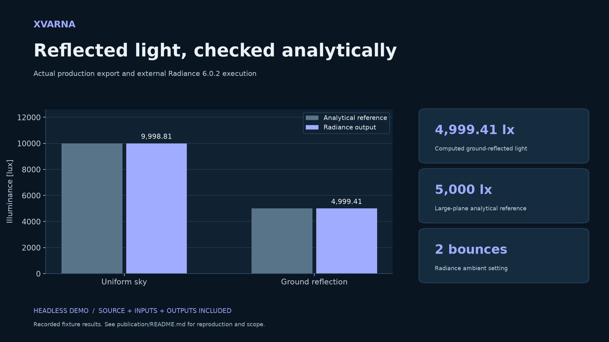

# Xvarna — reproducible publication example



The actual Radiance runner returns about 9,998.81 lux under a 10,000-lux uniform sky and 4,999.41 lux of ground-reflected light against a 5,000-lux large-plane reference. The CSV is retained with the reproduction command.

## Reproduce the data

Run from the repository root after following its build instructions. The command writes into `publication/`; keep that directory present. Installed SDKs, built native libraries, model weights or Radiance are required only where named.

```powershell
$env:RAYPATH = 'C:/Radiance/lib'
cargo run -p xvarna-hvare --example radiance_acceptance --locked -- 'C:/Radiance/bin' publication/radiance.csv
```

Primary retained data: [radiance.csv](radiance.csv). The figure is a rendering of these retained results, not a screenshot of the host application. Fixture inputs are in the linked demo source. Results were recorded locally on Windows x64 on 2026-09-19; they are not remote CI badges.

## Regenerate the figure

```powershell
python -m pip install -r publication/requirements.txt
python publication/render_figure.py
```

The PNG is 1920 × 1080, suitable for README and LinkedIn use; the SVG remains editable. Both use the same data. The data-generation programs assert the fixture results; the renderer reads the retained output.

## Scope

Analytical sky/ground fixture, not a measured-building validation. Fast daylight intentionally omits interreflection; use the separate Radiance path when it matters.

## Publication assets

- `evidence.png`: prepared social/README image.
- `evidence.svg`: editable vector figure.
- `linkedin.md`: English introduction draft and image description.
- `manifest.json`: SHA-256 identity of the demo source, data and graphics.

These files are prepared assets; no GitHub or LinkedIn publication is implied.

## Demo source

- [crates/xvarna-hvare/examples/radiance_acceptance.rs](../crates/xvarna-hvare/examples/radiance_acceptance.rs)
